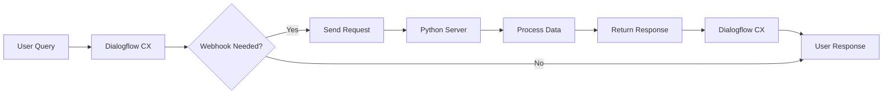

# Webhooks in Dialogflow CX: Complete Python Guide 🤖🔄

## 1. Introduction to Webhooks in Dialogflow CX 🌐

Webhooks serve as the bridge between Dialogflow CX and external systems, allowing your conversation agents to interact with databases, APIs, and business logic. They enable dynamic responses based on real-time data processing.

### Core Concepts

| Concept | Description |
|---------|-------------|
| **Webhook** | HTTP callback that sends data to an external service |
| **Fulfillment** | The action of using a webhook to complete a request |
| **Service** | The external system handling the webhook request |
| **Tag** | Identifier connecting a flow or page to a specific webhook |

> 💡 **Key Insight**: Webhooks transform your Dialogflow CX agent from a static conversation flow into a dynamic, data-driven application.

---

## 2. How Webhooks Function in Dialogflow CX 🔄



Webhooks in Dialogflow CX follow this execution pattern:
1. **Trigger**: Intent matching or event occurs
2. **Request**: Dialogflow sends a JSON request to your webhook
3. **Processing**: Your Python service processes the request
4. **Response**: Your service sends formatted JSON back
5. **Fulfillment**: Dialogflow uses the response in the conversation

---

## 3. Setting Up Webhooks in Dialogflow CX ⚙️

### Dialogflow CX Configuration

1. Navigate to **Manage** tab → **Webhooks**
2. Click **Create**
3. Configure the webhook:
   - Set a descriptive name
   - Enter your service URL
   - Configure authentication (if needed)
   - Set timeout values (default: 5 seconds)

### Security Considerations 🔒

- Use **HTTPS** for all production webhooks
- Implement proper authentication
- Consider request validation
- Monitor traffic patterns

---

## 4. Python Implementation for Dialogflow CX Webhooks 🐍

### Flask-Based Webhook Server

```python
from flask import Flask, request, jsonify
import json

app = Flask(__name__)

@app.route('/webhook', methods=['POST'])
def webhook():
    """Handle webhook requests from Dialogflow CX."""
    # Parse the request
    request_data = request.get_json(silent=True)
    
    # Extract session info
    session_id = request_data.get('sessionInfo', {}).get('session', '')
    
    # Extract parameters
    params = request_data.get('sessionInfo', {}).get('parameters', {})
    
    # Process the request (example: get weather data)
    result = process_request(params)
    
    # Format the response
    response = {
        "fulfillmentResponse": {
            "messages": [
                {
                    "text": {
                        "text": [result]
                    }
                }
            ]
        },
        "sessionInfo": {
            "parameters": {
                "processed_result": result
            }
        }
    }
    
    return jsonify(response)

def process_request(params):
    """Process the request and return a response."""
    # Your business logic here
    return f"Processed parameters: {params}"

if __name__ == '__main__':
    app.run(debug=True, host='0.0.0.0', port=8080)
```

### FastAPI Alternative (More Performant)

```python
from fastapi import FastAPI, Request
from fastapi.responses import JSONResponse
import uvicorn

app = FastAPI()

@app.post("/webhook")
async def dialogflow_webhook(request: Request):
    """Handle webhook requests from Dialogflow CX using FastAPI."""
    request_data = await request.json()
    
    # Extract session info
    session_id = request_data.get('sessionInfo', {}).get('session', '')
    
    # Extract parameters
    params = request_data.get('sessionInfo', {}).get('parameters', {})
    
    # Process the request
    result = process_request(params)
    
    # Format the response
    response = {
        "fulfillmentResponse": {
            "messages": [
                {
                    "text": {
                        "text": [result]
                    }
                }
            ]
        },
        "sessionInfo": {
            "parameters": {
                "processed_result": result
            }
        }
    }
    
    return JSONResponse(content=response)

def process_request(params):
    """Process the request and return a response."""
    # Your business logic here
    return f"Processed parameters: {params}"

if __name__ == "__main__":
    uvicorn.run("main:app", host="0.0.0.0", port=8080, reload=True)
```

---

## 5. Request and Response Formats 📊

### Request Structure

```json
{
  "detectIntentResponseId": "response-id",
  "intentInfo": {
    "lastMatchedIntent": "projects/project-id/locations/location-id/agents/agent-id/intents/intent-id",
    "parameters": {
      "parameter-name": {
        "originalValue": "parameter-value",
        "resolvedValue": "resolved-value"
      }
    },
    "displayName": "trigger-intent-display-name"
  },
  "pageInfo": {
    "currentPage": "projects/project-id/locations/location-id/agents/agent-id/flows/flow-id/pages/page-id",
    "displayName": "page-display-name"
  },
  "sessionInfo": {
    "session": "projects/project-id/locations/location-id/agents/agent-id/sessions/session-id",
    "parameters": {
      "param1": "value1",
      "param2": "value2"
    }
  },
  "fulfillmentInfo": {
    "tag": "webhook-tag"
  },
  "messages": []
}
```

### Response Structure

```json
{
  "fulfillmentResponse": {
    "messages": [
      {
        "text": {
          "text": ["Response text here"]
        }
      },
      {
        "payload": {
          "richContent": [
            [
              {
                "type": "button",
                "icon": {
                  "type": "chevron_right",
                  "color": "#FF9800"
                },
                "text": "Button text",
                "link": "https://example.com"
              }
            ]
          ]
        }
      }
    ],
    "mergeBehavior": "REPLACE"
  },
  "pageInfo": {
    "currentPage": "target-page-id",
    "formInfo": {
      "parameterInfo": [
        {
          "displayName": "param-name",
          "required": true,
          "state": "FILLED",
          "value": "param-value",
          "justCollected": true
        }
      ]
    }
  },
  "sessionInfo": {
    "parameters": {
      "param1": "updated-value1",
      "param2": "updated-value2"
    }
  },
  "targetFlow": "target-flow-id",
  "targetPage": "target-page-id"
}
```

---

## 6. Advanced Python Webhook Features 🚀

### Parameter Handling

```python
def extract_parameters(request_data):
    """Extract and validate parameters from the request."""
    try:
        # Get session parameters
        params = request_data.get('sessionInfo', {}).get('parameters', {})
        
        # Get intent parameters (often more specific)
        intent_params = request_data.get('intentInfo', {}).get('parameters', {})
        
        # Process intent parameters into a more usable format
        for key, value in intent_params.items():
            if isinstance(value, dict) and 'resolvedValue' in value:
                params[key] = value.get('resolvedValue')
            elif isinstance(value, dict) and 'originalValue' in value:
                params[key] = value.get('originalValue')
        
        return params
    except Exception as e:
        print(f"Error extracting parameters: {e}")
        return {}
```

### Dynamic Response Creation

```python
def create_response(text_responses, parameters=None, target_page=None):
    """Create a properly formatted webhook response with various options."""
    if not isinstance(text_responses, list):
        text_responses = [text_responses]
        
    response = {
        "fulfillmentResponse": {
            "messages": [
                {
                    "text": {
                        "text": text_responses
                    }
                }
            ]
        }
    }
    
    # Add or update session parameters
    if parameters:
        response["sessionInfo"] = {
            "parameters": parameters
        }
    
    # Set target page if provided
    if target_page:
        response["targetPage"] = target_page
        
    return response
```

### Rich Response Example

```python
def create_rich_response(items):
    """Create a rich response with cards, buttons, or other UI elements."""
    rich_content = []
    
    # Add each item to the rich content
    for item in items:
        if item.get('type') == 'card':
            rich_content.append({
                "type": "info",
                "title": item.get('title', ''),
                "subtitle": item.get('subtitle', ''),
                "image": {
                    "src": {
                        "rawUrl": item.get('image_url', '')
                    }
                },
                "actionLink": item.get('link', '')
            })
        elif item.get('type') == 'button':
            rich_content.append({
                "type": "button",
                "icon": {
                    "type": "chevron_right",
                    "color": "#FF9800"
                },
                "text": item.get('text', 'Click here'),
                "link": item.get('link', '')
            })
    
    return {
        "fulfillmentResponse": {
            "messages": [
                {
                    "payload": {
                        "richContent": [rich_content]
                    }
                }
            ]
        }
    }
```

---

## 7. Common Webhook Use Cases in Dialogflow CX 🛠️

### 1. Database Integration

```python
import sqlite3

def query_database(user_id, query_type):
    """Query a database and return formatted results."""
    conn = sqlite3.connect('your_database.db')
    cursor = conn.cursor()
    
    if query_type == 'account_balance':
        cursor.execute("SELECT balance FROM accounts WHERE user_id = ?", (user_id,))
        result = cursor.fetchone()
        balance = result[0] if result else 0
        
        conn.close()
        return f"Your current account balance is ${balance}."
    
    elif query_type == 'recent_transactions':
        cursor.execute(
            "SELECT amount, date, description FROM transactions " 
            "WHERE user_id = ? ORDER BY date DESC LIMIT 5", 
            (user_id,)
        )
        transactions = cursor.fetchall()
        conn.close()
        
        if not transactions:
            return "You have no recent transactions."
        
        response = "Here are your recent transactions:\n"
        for amount, date, description in transactions:
            response += f"• {date}: {description} - ${amount}\n"
        
        return response
```

### 2. API Integration (Weather Example)

```python
import requests

def get_weather(location):
    """Get weather information from an external API."""
    api_key = "your_api_key"
    url = f"https://api.weatherapi.com/v1/current.json?key={api_key}&q={location}"
    
    try:
        response = requests.get(url)
        data = response.json()
        
        if "error" in data:
            return f"Sorry, I couldn't find weather information for {location}."
        
        location_name = data['location']['name']
        temp_c = data['current']['temp_c']
        condition = data['current']['condition']['text']
        
        return f"The current weather in {location_name} is {condition} with a temperature of {temp_c}°C."
    
    except Exception as e:
        print(f"Error getting weather: {e}")
        return "Sorry, I couldn't retrieve the weather information at this time."
```

### 3. External Service Integration (Appointment Booking)

```python
import datetime
import requests

def book_appointment(service_type, date, time, user_info):
    """Book an appointment with an external scheduling system."""
    # Format the data for the external API
    appointment_data = {
        "service": service_type,
        "datetime": f"{date}T{time}",
        "customer": {
            "name": user_info.get("name"),
            "email": user_info.get("email"),
            "phone": user_info.get("phone")
        }
    }
    
    # Make the API request
    try:
        response = requests.post(
            "https://your-booking-system.com/api/appointments",
            json=appointment_data,
            headers={"Authorization": "Bearer your_api_key"}
        )
        
        if response.status_code == 200:
            data = response.json()
            confirmation_id = data.get("confirmation_id")
            
            # Return a confirmation message with the details
            return {
                "text": f"Great! I've booked your {service_type} appointment for {date} at {time}. Your confirmation number is {confirmation_id}.",
                "parameters": {
                    "confirmation_id": confirmation_id,
                    "appointment_service": service_type,
                    "appointment_date": date,
                    "appointment_time": time
                }
            }
        else:
            # Handle booking failure
            error_message = response.json().get("error", "Unknown error")
            return {
                "text": f"I'm sorry, I couldn't book your appointment. The system says: {error_message}",
                "parameters": {
                    "booking_error": error_message
                }
            }
            
    except Exception as e:
        print(f"Error booking appointment: {e}")
        return {
            "text": "I'm sorry, there was a problem connecting to our booking system. Please try again later.",
            "parameters": {
                "booking_error": str(e)
            }
        }
```

---

## 8. Testing Webhooks 🧪

### Local Testing with ngrok

```bash
# Install ngrok
pip install pyngrok

# Run your Flask/FastAPI app
python webhook_server.py &

# Expose your local server
ngrok http 8080
```

### Webhook Testing Python Script

```python
import requests
import json

def test_webhook(url, test_payload, display_response=True):
    """Test a webhook with a sample payload."""
    headers = {'Content-Type': 'application/json'}
    
    print(f"🧪 Testing webhook at: {url}")
    print(f"📤 Sending payload: {json.dumps(test_payload, indent=2)}")
    
    try:
        response = requests.post(url, json=test_payload, headers=headers)
        print(f"📊 Status Code: {response.status_code}")
        
        if response.status_code == 200:
            if display_response:
                print(f"📥 Response: {json.dumps(response.json(), indent=2)}")
            print("✅ Test successful!")
            return response.json()
        else:
            print(f"❌ Test failed with status code: {response.status_code}")
            print(f"📥 Response: {response.text}")
            return None
            
    except Exception as e:
        print(f"❌ Error testing webhook: {e}")
        return None

# Example test payload
sample_payload = {
    "detectIntentResponseId": "test-response-id",
    "intentInfo": {
        "lastMatchedIntent": "projects/test-project/locations/global/agents/test-agent/intents/test-intent",
        "parameters": {
            "location": {
                "originalValue": "New York",
                "resolvedValue": "New York"
            }
        },
        "displayName": "get_weather"
    },
    "sessionInfo": {
        "session": "projects/test-project/locations/global/agents/test-agent/sessions/test-session",
        "parameters": {
            "location": "New York"
        }
    },
    "fulfillmentInfo": {
        "tag": "weather-webhook"
    }
}

# Run the test
test_webhook("http://localhost:8080/webhook", sample_payload)
```

---

## 9. Best Practices for Python Webhooks 🌟

### 1. Error Handling and Logging

```python
import logging
from functools import wraps

# Configure logging
logging.basicConfig(
    level=logging.INFO,
    format='%(asctime)s - %(name)s - %(levelname)s - %(message)s',
    handlers=[
        logging.FileHandler("webhook.log"),
        logging.StreamHandler()
    ]
)
logger = logging.getLogger(__name__)

def error_handler(f):
    """Decorator to handle errors in webhook functions."""
    @wraps(f)
    def wrapper(*args, **kwargs):
        try:
            return f(*args, **kwargs)
        except Exception as e:
            error_msg = f"Error in {f.__name__}: {str(e)}"
            logger.error(error_msg, exc_info=True)
            
            # Return a graceful error response
            return {
                "fulfillmentResponse": {
                    "messages": [
                        {
                            "text": {
                                "text": ["I'm sorry, but I'm having trouble processing your request right now."]
                            }
                        }
                    ]
                },
                "sessionInfo": {
                    "parameters": {
                        "error_occurred": True,
                        "error_message": str(e)
                    }
                }
            }
    return wrapper

@app.route('/webhook', methods=['POST'])
@error_handler
def webhook():
    """Handle webhook requests from Dialogflow CX."""
    request_data = request.get_json(silent=True)
    logger.info(f"Received webhook request: {request_data}")
    
    # Process the request...
    
    response = create_response(["Your response here"])
    logger.info(f"Sending response: {response}")
    return jsonify(response)
```

### 2. Performance Optimization

```python
import cachetools

# Create a TTL cache (time-to-live)
weather_cache = cachetools.TTLCache(maxsize=100, ttl=1800)  # Cache for 30 minutes

def get_weather_cached(location):
    """Get weather with caching for better performance."""
    # Check if we have a cached result
    if location in weather_cache:
        return weather_cache[location]
    
    # If not in cache, call the actual function
    result = get_weather(location)
    
    # Store in cache for future requests
    weather_cache[location] = result
    
    return result
```

### 3. Structured Project Organization

```
dialogflow-webhook/
│
├── app.py               # Main application entry point
├── config.py            # Configuration settings
├── requirements.txt     # Dependencies
│
├── services/            # External service integrations
│   ├── __init__.py
│   ├── database.py      # Database connection handling
│   ├── weather_api.py   # Weather API integration
│   └── booking_api.py   # Booking system integration
│
├── handlers/            # Intent handlers
│   ├── __init__.py
│   ├── weather.py       # Weather intent handlers
│   ├── booking.py       # Booking intent handlers
│   └── fallback.py      # Fallback intent handlers
│
├── utils/               # Utility functions
│   ├── __init__.py
│   ├── response.py      # Response formatting helpers
│   └── logging.py       # Logging setup
│
└── tests/               # Tests
    ├── __init__.py
    ├── test_weather.py
    └── test_booking.py
```

---

## 10. Troubleshooting Common Issues 🔍

### 1. Connection Issues

- **Symptom**: Webhook timeout errors in Dialogflow
- **Possible Causes**:
  - Server not accessible from internet
  - Server response too slow
  - Incorrect URL configuration
- **Solutions**:
  - Verify server is accessible (use `curl` or Postman)
  - Increase timeout setting in Dialogflow (max 30s)
  - Check for long-running operations in your code
  
### 2. Authentication Problems

- **Symptom**: 401/403 errors
- **Solutions**:
  - Check headers and auth tokens
  - Verify API keys
  - Test authentication separately

```python
# Example: Testing webhook authentication
def test_auth():
    """Test if authentication is working correctly."""
    headers = {
        'Authorization': 'Bearer your_token',
        'Content-Type': 'application/json'
    }
    
    response = requests.post(
        "https://your-webhook-url.com/webhook",
        headers=headers,
        json={"test": "authentication"}
    )
    
    print(f"Status: {response.status_code}")
    print(f"Response: {response.text}")
```

### 3. Payload Format Issues

- **Symptom**: 400 Bad Request errors or unexpected behavior
- **Solutions**:
  - Validate request and response formats
  - Check for missing required fields
  - Test with simplified payloads
  - Implement structured logging

```python
def validate_dialogflow_request(request_data):
    """Validate that a request has the minimum required structure."""
    if not isinstance(request_data, dict):
        return False
        
    # Check for critical fields
    if 'sessionInfo' not in request_data:
        return False
        
    if not isinstance(request_data.get('sessionInfo'), dict):
        return False
        
    # Basic validation passed
    return True
```

---

## 11. Deployment Options 🚀

### Option 1: Google Cloud Functions

```python
# main.py for Google Cloud Functions
from flask import jsonify

def webhook(request):
    """Entry point for Cloud Functions."""
    request_data = request.get_json(silent=True)
    
    # Process the request...
    
    response = {
        "fulfillmentResponse": {
            "messages": [
                {
                    "text": {
                        "text": ["Response from Cloud Functions"]
                    }
                }
            ]
        }
    }
    
    return jsonify(response)
```

### Option 2: AWS Lambda with API Gateway

```python
# lambda_function.py
import json

def lambda_handler(event, context):
    """AWS Lambda handler for webhook requests."""
    # Parse the request from API Gateway
    body = json.loads(event.get('body', '{}'))
    
    # Process the request...
    
    # Create the response
    response = {
        "fulfillmentResponse": {
            "messages": [
                {
                    "text": {
                        "text": ["Response from AWS Lambda"]
                    }
                }
            ]
        }
    }
    
    return {
        'statusCode': 200,
        'body': json.dumps(response),
        'headers': {
            'Content-Type': 'application/json'
        }
    }
```

### Option 3: Docker Container Deployment

```dockerfile
# Dockerfile
FROM python:3.9-slim

WORKDIR /app

COPY requirements.txt .
RUN pip install --no-cache-dir -r requirements.txt

COPY . .

EXPOSE 8080

CMD ["python", "app.py"]
```

---

## 12. Security Best Practices 🔒

### Authentication Implementation

```python
import hmac
import hashlib
from functools import wraps
from flask import request, jsonify, abort

def verify_dialogflow_request(f):
    """Verify that requests are coming from Dialogflow."""
    @wraps(f)
    def decorated_function(*args, **kwargs):
        # Get the authorization header
        auth_header = request.headers.get('Authorization')
        
        if not auth_header:
            return jsonify({"error": "No Authorization header"}), 401
            
        # Extract the token
        try:
            auth_type, token = auth_header.split(' ', 1)
            if auth_type.lower() != 'bearer':
                return jsonify({"error": "Invalid Authorization type"}), 401
        except ValueError:
            return jsonify({"error": "Invalid Authorization header format"}), 401
            
        # Verify the token
        expected_token = "your-secret-token"  # Store this securely
        if not hmac.compare_digest(token, expected_token):
            return jsonify({"error": "Invalid token"}), 403
            
        return f(*args, **kwargs)
    return decorated_function

@app.route('/webhook', methods=['POST'])
@verify_dialogflow_request
def webhook():
    """Handle webhook requests from Dialogflow CX."""
    # Process the authenticated request...
    pass
```

### Request Validation

```python
def validate_request_structure(request_data):
    """Validate the structure of incoming requests."""
    required_fields = [
        'sessionInfo',
        'intentInfo'
    ]
    
    for field in required_fields:
        if field not in request_data:
            return False, f"Missing required field: {field}"
    
    # Additional validation as needed
    
    return True, "Valid request"
```

---

## 13. Advanced Integrations and Techniques 🧠

### 1. Integration with NLP Libraries

```python
import spacy

# Load spaCy model
nlp = spacy.load("en_core_web_sm")

def analyze_text(text):
    """Perform additional NLP analysis on user text."""
    doc = nlp(text)
    
    # Extract entities
    entities = {ent.text: ent.label_ for ent in doc.ents}
    
    # Extract sentiment (simplified)
    sentiment = "positive" if doc.sentiment > 0.1 else "negative" if doc.sentiment < -0.1 else "neutral"
    
    # Extract key phrases (simplified)
    key_phrases = [chunk.text for chunk in doc.noun_chunks]
    
    return {
        "entities": entities,
        "sentiment": sentiment,
        "key_phrases": key_phrases
    }
```

### 2. Machine Learning Integration

```python
import pickle
import numpy as np
from sklearn.feature_extraction.text import TfidfVectorizer

# Load pre-trained classifier and vectorizer
with open('models/classifier.pkl', 'rb') as f:
    classifier = pickle.load(f)
    
with open('models/vectorizer.pkl', 'rb') as f:
    vectorizer = pickle.load(f)

def predict_category(text):
    """Predict a category for the given text."""
    # Transform text using the same vectorizer used during training
    features = vectorizer.transform([text])
    
    # Make prediction
    prediction = classifier.predict(features)[0]
    
    # Get prediction probabilities
    proba = classifier.predict_proba(features)[0]
    confidence = np.max(proba) * 100
    
    return {
        "category": prediction,
        "confidence": round(confidence, 2)
    }
```

---

## 14. Full End-to-End Example 🔄

```python
from flask import Flask, request, jsonify
import logging
import requests
import json
from functools import wraps

# Configure logging
logging.basicConfig(level=logging.INFO)
logger = logging.getLogger(__name__)

app = Flask(__name__)

# Error handling decorator
def handle_errors(f):
    @wraps(f)
    def decorated_function(*args, **kwargs):
        try:
            return f(*args, **kwargs)
        except Exception as e:
            logger.error(f"Error: {str(e)}", exc_info=True)
            return jsonify({
                "fulfillmentResponse": {
                    "messages": [
                        {
                            "text": {
                                "text": ["I'm sorry, but I encountered an error processing your request."]
                            }
                        }
                    ]
                }
            }), 200  # Return 200 so Dialogflow can use the error message
    return decorated_function

# Request validation function
def validate_request(request_data):
    if not request_data:
        return False, "Empty request"
    
    if 'sessionInfo' not in request_data:
        return False, "Missing sessionInfo"
        
    return True, "Valid request"

# Main webhook handler
@app.route('/webhook', methods=['POST'])
@handle_errors
def webhook():
    """Main webhook handler for Dialogflow CX."""
    # Get the request data
    request_data = request.get_json(silent=True)
    logger.info(f"Received request: {json.dumps(request_data, indent=2)}")
    
    # Validate the request
    is_valid, message = validate_request(request_data)
    if not is_valid:
        logger.error(f"Invalid request: {message}")
        return jsonify({
            "fulfillmentResponse": {
                "messages": [
                    {
                        "text": {
                            "text": ["I'm sorry, but I received an invalid request."]
                        }
                    }
                ]
            }
        })
    
    # Extract key information
    session = request_data.get('sessionInfo', {}).get('session', '')
    parameters = request_data.get('sessionInfo', {}).get('parameters', {})
    intent_info = request_data.get('intentInfo', {})
    intent_display_name = intent_info.get('displayName', '')
    tag = request_data.get('fulfillmentInfo', {}).get('tag', '')
    
    logger.info(f"Processing intent: {intent_display_name} with tag: {tag}")
    
    # Route to the appropriate handler based on the tag or intent
    if tag == 'weather':
        return handle_weather(parameters)
    elif tag == 'database-query':
        return handle_database_query(parameters)
    elif intent_display_name == 'booking.create':
        return handle_booking(parameters)
    else:
        # Default handler
        return handle_default(parameters)

def handle_weather(parameters):
    """Handle weather intent."""
    location = parameters.get('location', 'unknown')
    
    if location == 'unknown':
        return jsonify({
            "fulfillmentResponse": {
                "messages": [
                    {
                        "text": {
                            "text": ["I need a location to check the weather. Could you please specify where?"]
                        }
                    }
                ]
            }
        })
    
    # Call weather API (simulated)
    weather_info = get_weather_info(location)
    
    return jsonify({
        "fulfillmentResponse": {
            "messages": [
                {
                    "text": {
                        "text": [f"The weather in {location} is {weather_info['condition']} with a temperature of {weather_info['temperature']}°C."]
                    }
                }
            ]
        },
        "sessionInfo": {
            "parameters": {
                "weather_condition": weather_info['condition'],
                "temperature": weather_info['temperature']
            }
        }
    })

def get_weather_info(location):
    """Simulate getting weather information."""
    # In a real implementation, you would call a weather API
    # For this example, we'll return mock data
    return {
        "condition": "sunny",
        "temperature": 22,
        "humidity": 60,
        "wind_speed": 10
    }

def handle_database_query(parameters):
    """Handle database query intent."""
    query_type = parameters.get('query_type', '')
    user_id = parameters.get('user_id', '')
    
    # Simulate database query
    if query_type == 'account_balance':
        balance = 1250.75  # In a real app, query this from database
        
        return jsonify({
            "fulfillmentResponse": {
                "messages": [
                    {
                        "text": {
                            "text": [f"Your current account balance is ${balance:.2f}."]
                        }
                    }
                ]
            }
        })
    else:
        return jsonify({
            "fulfillmentResponse": {
                "messages": [
                    {
                        "text": {
                            "text": ["I'm not sure what information you're looking for. Could you be more specific?"]
                        }
                    }
                ]
            }
        })

def handle_booking(parameters):
    """Handle booking intent."""
    service = parameters.get('service', '')
    date = parameters.get('date', '')
    time = parameters.get('time', '')
    
    if not service or not date or not time:
        missing = []
        if not service:
            missing.append("service type")
        if not date:
            missing.append("date")
        if not time:
            missing.append("time")
            
        return jsonify({
            "fulfillmentResponse": {
                "messages": [
                    {
                        "text": {
                            "text": [f"I need more information to book your appointment. Please provide: {', '.join(missing)}."]
                        }
                    }
                ]
            }
        })
    
    # Simulate booking confirmation
    confirmation_id = "BK12345"
    
    return jsonify({
        "fulfillmentResponse": {
            "messages": [
                {
                    "text": {
                        "text": [f"Great! I've booked your {service} appointment for {date} at {time}. Your confirmation number is {confirmation_id}."]
                    }
                }
            ]
        },
        "sessionInfo": {
            "parameters": {
                "confirmation_id": confirmation_id,
                "booking_status": "confirmed"
            }
        }
    })

def handle_default(parameters):
    """Handle default/fallback intent."""
    return jsonify({
        "fulfillmentResponse": {
            "messages": [
                {
                    "text": {
                        "text": ["I've received your request, but I'm not sure how to process it. Can you provide more details?"]
                    }
                }
            ]
        }
    })

if __name__ == '__main__':
    app.run(debug=True, host='0.0.0.0', port=8080)
```

---

## Summary: Key Takeaways 📝

1. **Webhooks are essential** for creating dynamic, data-driven conversational experiences in Dialogflow CX
2. **Python** offers flexible, powerful frameworks (Flask, FastAPI) for implementing webhook services
3. **Proper request/response handling** is critical for webhook functionality
4. **Best practices** include error handling, logging, and security implementation
5. **Testing** should be thorough and include local and production environments
6. **Deployment options** include cloud functions, serverless platforms, and containerized solutions

---

## Additional Resources 📚

- [Official Dialogflow CX Webhook Documentation](https://cloud.google.com/dialogflow/cx/docs/concept/webhook)
- [Flask Documentation](https://flask.palletsprojects.com/)
- [FastAPI Documentation](https://fastapi.tiangolo.com/)
- [Google Cloud Functions Python Tutorial](https://cloud.google.com/functions/docs/tutorials/python)
- [AWS Lambda Python Guide](https://docs.aws.amazon.com/lambda/latest/dg/python-handler.html)

Happy building! 🚀🤖
